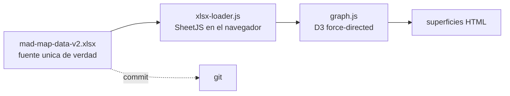

# Investigación e[ad]

Mapa dinámico del cuerpo investigativo del **Doctorado en Arquitectura y Diseño** de la e[ad] PUCV. Las cuatro líneas troncales del programa, sus sublíneas y los profesores que las cultivan, en una visualización interactiva que se alimenta directamente de un único archivo Excel commiteado en el repositorio.

> *La obra como argumento.* El doctorado forma investigadores para quienes la obra es origen y prueba de la tesis. La pregunta que esa obra está llamada a argumentar: **cómo reinventar el habitar humano**.

| | |
|---|---|
| **Visualización** | [eadpucv.github.io/investigacion-ead](https://eadpucv.github.io/investigacion-ead/) |
| **Documento institucional** | [lineas-investigacion.md](./lineas-investigacion.md) |
| **Fuente de datos** | [`mad-map-data-v2.xlsx`](./mad-map-data-v2.xlsx) en la raíz del repo |

## Cómo funciona

Toda la información del mapa vive en un único archivo `mad-map-data-v2.xlsx` versionado en este repositorio. La visualización lo carga **directamente en el navegador** usando SheetJS, sin pasos intermedios: no hay JSON precomputado, no hay scripts Python que ejecutar, no hay servicios externos.



Para actualizar la visualización el flujo completo es: editar el `.xlsx` en Excel/Numbers/LibreOffice, guardar, hacer commit y push, refrescar el navegador. La página descarga el archivo, lo parsea, deriva las relaciones y dibuja el grafo.

## Trade-offs de esta arquitectura[^1]

[^1]: Decisión deliberada: simplicidad y portabilidad sobre edición concurrente.

El precio de tener un archivo Excel commiteado como base de datos es que dos personas no pueden editarlo a la vez sin generar conflicto de merge en git. A cambio se obtiene un repositorio totalmente autocontenido: cualquiera con `git clone` tiene la versión completa de los datos y puede levantar el sitio localmente con un servidor HTTP estático. Cero servicios externos, cero credenciales, cero dependencias de red en tiempo de visualización.

La segunda consecuencia es que el layout cambia entre cargas. El motor force-directed parte de posiciones aleatorias y converge a un equilibrio que no es único; al recargar la página los nodos quedan reacomodados de forma similar pero no idéntica. Esto se eligió a propósito frente a la alternativa de un embedding estructural por PCA, que añadía complejidad inorgánica sin producir lecturas significativamente mejores.

## Las tres superficies

Las tres páginas comparten el mismo motor (`graph.js`) pero exponen controles, aristas y nodos distintos según su audiencia. *Cartografía* es la vista pública para postulantes: muestra las cuatro líneas y sus sublíneas como territorio temático, sin perfiles individuales. *Narrativa* está pensada para evaluadores y CNA: activa la capa de profesores y dos vistas predefinidas, *cobertura por línea* y *perfiles por área*. *Exploración* es la herramienta interna del equipo del doctorado, con todos los controles disponibles, los siete tipos de aristas como toggles y filtros completos por línea, área, modo, salida, laboratorio e investigador.

Cada superficie tiene una columna lateral de controles y una zona principal con el grafo. Click en cualquier nodo abre el panel de detalle al lado derecho. Hover muestra tooltip con el nombre. Drag reposiciona temporalmente; al soltar las fuerzas reacomodan.

## Documento institucional

[`lineas-investigacion.md`](./lineas-investigacion.md) describe formalmente cada línea: alcance temático, pregunta nuclear, cuerpo académico que la sostiene y argumentación de su consolidación y sostenibilidad. Pensado para audiencia institucional (CNA, comité doctoral, autoridades).

Para regenerarlo después de una edición significativa de la planilla:

```bash
python3 tools/build_doc.py
```

(Sólo es necesario regenerar cuando cambia el cuerpo académico, las sublíneas o las descripciones de las líneas; no para cada edición menor del archivo.)

## Guía para editores de la planilla

Todo lo que ves en las visualizaciones viene directamente de [`mad-map-data-v2.xlsx`](./mad-map-data-v2.xlsx). Esta sección explica cómo se construye el layout de cada vista, qué define la cercanía entre nodos y cómo cada hoja del archivo incide en lo que se ve.

### Las hojas de relación referencian por nombre, no por ID

En las hojas de relación (`02_Sublineas`, `08_Temas`, `10_Lab_Linea`, `11_Lab_Salida`, `12_Investigador_Lab`, `13_Investigador_Modo`, `14_Linea_Modo`, `18_Proximidad_Tematica`) las columnas referenciales guardan el **nombre** de la entidad, no su código. Las celdas tienen **listas desplegables dinámicas** que muestran los nombres de las entidades existentes. Al editar una sublínea no escribes `LIN-01`, sino que eliges "Personas, interacción y sistemas inclusivos" del menú; al asignar un investigador a un laboratorio eliges "Herbert Spencer González" en vez de `INV-HSG`.

Las hojas primarias (`01_Lineas`, `03_Areas`, `04_Modos`, `05_Salidas`, `06_Laboratorios`, `07_Investigadores`) **conservan** una columna `id` interna (clave estable que el motor del grafo usa internamente). Esa columna existe pero el editor humano no la necesita para armar referencias: solo la verá si pone atención. El loader de la visualización resuelve los nombres a IDs internos al cargar.

Si dos entidades tuvieran el mismo nombre (no debería suceder), el loader emite un warning en la consola del navegador y usa la primera ocurrencia. Si una celda referencial guarda un nombre que ya no existe en la hoja entidad, el loader lo reporta y omite la fila para no propagar referencias rotas a la visualización.

### IDs internos de investigadores

La columna `id` de `07_Investigadores` usa iniciales del nombre completo: `INV-HSG` para Herbert Spencer González, `INV-MWU` para Michèle Wilkomirsky Uribe. Es la única hoja primaria donde el ID no es totalmente opaco. Los editores no necesitan tocar esta columna para armar referencias en otras hojas (eso ya se hace por nombre con dropdowns), pero si en algún momento aparece, el código identifica a la persona sin ambigüedad.

Al agregar un nuevo investigador, asígnale un ID con iniciales siguiendo la misma convención. Si dudas sobre cómo construir el ID o quieres regenerar uno antiguo, ejecuta:

```bash
python3 tools/rename_investigador_ids.py --dry-run    # muestra el mapping
python3 tools/rename_investigador_ids.py              # aplica el mapping
```

El script solo migra IDs con formato antiguo `INV-NN`; respeta los IDs ya en formato de iniciales. En caso de colisión (dos personas con mismas iniciales), agrega sufijo numérico (`INV-XYZ2`, `INV-XYZ3`).

Si en algún momento el `.xlsx` se reabre y los dropdowns se pierden (algunas conversiones a otros formatos los borran), se pueden volver a aplicar sin tocar los datos:

```bash
python3 tools/apply_dropdowns.py
```

Este script reconfigura los rangos con nombre dinámicos (`LineaNombres`, `SublineaNombres`, `AreaNombres`, `ModoNombres`, `SalidaNombres`, `LabNombres`, `InvestigadorNombres`) y reaplica la validación de datos a las columnas referenciales. Es idempotente: se puede correr cuantas veces sea necesario.

### Cómo se construye el layout espacial

El layout es un **grafo force-directed** (biblioteca D3 v7). No hay coordenadas fijas: cada nodo tiene una masa y cada arista actúa como un resorte. El motor de física corre hasta que el sistema se estabiliza.

Hay tres tipos de nodo. Las **líneas troncales** se dibujan como círculos rojos grandes y reciben repulsión muy alta (−1 000); con sólo cuatro líneas y esa carga, ocupan naturalmente las cuatro esquinas del espacio. Las **sublíneas** son círculos negros medianos con repulsión media (−180); orbitan alrededor de su línea-madre y crecen en tamaño con el número de investigadores que las cultivan. Los **investigadores** son cuadrados grises ligeros (−60); cuando la capa de perfiles está activa, se interponen entre las sublíneas que cultivan.

Cada tipo de arista es un resorte con distancia natural y rigidez propias. Activar un tipo de arista equivale a añadir una fuerza de atracción entre los nodos que cumplen esa relación: esos nodos se acercan en pantalla.

| Letra | Nombre | Qué la genera | Distancia | Rigidez | Lectura |
|---|---|---|---|---|---|
| a | Jerárquica | `02_Sublineas` → `línea` | 45 px | 0.85 | Pega cada sublínea a su línea-madre. Define los 4 clusters base. |
| b | Coautoría | `08_Temas` (sublínea ↔ investigador ↔ tema) | 70 px | 0.35 | Une investigador con sublínea. Los perfiles se enclavan entre sus sublíneas. |
| c | Coinvestigación | Derivada de (b) | 130 px | 0.15 | Atrae sublíneas que comparten investigador. Revela cuerpos transversales. |
| d | Sostén de lab | `10_Lab_Linea` | 130 px | 0.35 | Une laboratorio con línea. |
| e | Afinidad por lab | Derivada de (d) | 200 px | 0.04 | Señal suave entre sublíneas con lab compartido. |
| f | Coincidencia de modo | `14_Linea_Modo` (`predominante`) | 220 px | 0.02 | Atracción casi imperceptible entre sublíneas con mismo modo predominante. |
| g | Proximidad semántica | `18_Proximidad_Tematica` | 90 px | 0.45 | La más expresiva después de la jerárquica. |

Dos sublíneas cercanas en pantalla comparten muchas aristas activas. La distancia no es semántica en sentido estricto: es gravitacional, más resortes implican mayor atracción.

### Lo que cada hoja afecta en el layout

| Hoja | Qué controla | Efecto al refrescar |
|---|---|---|
| `01_Lineas` | Nombres y descripciones de las 4 líneas | Etiquetas y panel de detalle de los 4 nodos rojos |
| `02_Sublineas` | Sublíneas con su línea y área (referenciadas por nombre) | Aristas jerárquicas (a) y los 4 clusters |
| `03_Areas` | Las 3 áreas del programa (ECH, EAA, FCT) | Qué sublíneas caben bajo cada envolvente de área |
| `04_Modos` | Modos de investigar | Envolventes de modo; aristas (f) si se activan |
| `05_Salidas` | Salidas (industria / academia / estado) | Envolventes de salida; filtro en Exploración |
| `06_Laboratorios` | Laboratorios del programa | Aristas (d) y (e) |
| `07_Investigadores` | Cuerpo académico | Nodos cuadrados; tamaño de sublíneas que cultivan |
| `08_Temas` | Temas atribuidos: cada fila vincula sublínea + investigador + texto del tema | Base de las aristas (b) coautoría y (c) coinvestigación |
| `10_Lab_Linea` | Lab que sostiene cada línea | Aristas (d); base de (e) |
| `11_Lab_Salida` | Salidas que produce cada lab | Filtros de salida en Exploración |
| `12_Investigador_Lab` | Vínculo investigador con lab | Filtros de lab en Exploración |
| `13_Investigador_Modo` | Modo de cada investigador | Filtros de modo en Exploración |
| `14_Linea_Modo` | Modos por línea | Aristas (f) sólo nivel `predominante` |
| `17_Sello` | Variante del sello formativo (marcar `ELEGIDO`) | Texto de carga y encabezado de la portada |
| `18_Proximidad_Tematica` | Pares de sublíneas con afinidad temática | Aristas (g), las más expresivas después de la jerarquía |

Para la hoja `18_Proximidad_Tematica`: las filas con columna `estado = DESCARTADO` se ignoran. Las demás deben estar en pares simétricos (A↔B y B↔A con el mismo valor de `afinidad`).

## Correr el sitio localmente

```bash
python3 -m http.server 8765
# abrir http://localhost:8765/
```

No requiere instalar nada: SheetJS y D3 se cargan desde CDN/local, y el archivo `.xlsx` está en el repo.

## Roadmap y contrato del sistema

El estado del sistema, los próximos pasos accionables y las invariantes que se garantizan están en [`roadmap.md`](./roadmap.md). Reemplaza al spec formal anterior (`mad-map.allium`) y se mantiene en Markdown para edición cotidiana.

## Versiones

| Branch | Modelo de datos | Estado |
|---|---|---|
| `xlsx` | Excel commiteado, parseo en navegador | **Activa** |
| `v2` | Iteración previa con pipeline Python local | Histórica |
| `v1` | Mapa MAD legacy del Magíster | Histórica |

## Estructura del proyecto

```
.
├── index.html                  ← portada con sello + 3 tarjetas
├── cartografia.html            ← superficie pública (postulantes)
├── narrativa.html              ← superficie evaluadores · CNA
├── exploracion.html            ← superficie equipo del doctorado
├── graph.js                    ← motor de visualización (D3 force-directed)
├── xlsx-loader.js              ← carga el .xlsx directo con SheetJS
├── style.css                   ← estilos compartidos
├── d3.v7.min.js                ← biblioteca D3
├── mad-map-data-v2.xlsx        ← fuente única de verdad (datos del mapa)
├── lineas-investigacion.md     ← documento institucional formal
├── roadmap.md                  ← roadmap accionable
├── mad-map.allium              ← especificación formal (Allium v3)
└── tools/
    ├── xlsx_loader.py              ← equivalente Python del xlsx-loader.js
    ├── build_doc.py                ← regenera lineas-investigacion.md desde el .xlsx
    ├── seed_xlsx.py                ← (sólo siembra inicial) reconstruye el .xlsx desde código
    ├── apply_dropdowns.py          ← reaplica selectores desplegables sin tocar los datos
    ├── rename_investigador_ids.py  ← migra IDs INV-NN a iniciales del nombre
    └── migrate_to_names.py         ← migra hojas de relación de IDs a nombres legibles
```

`tools/seed_xlsx.py` solo se usa si hay que reconstruir la planilla desde cero. Una vez sembrada, el `.xlsx` se edita a mano y ese script no debe volver a correrse: sobrescribe los cambios manuales.
