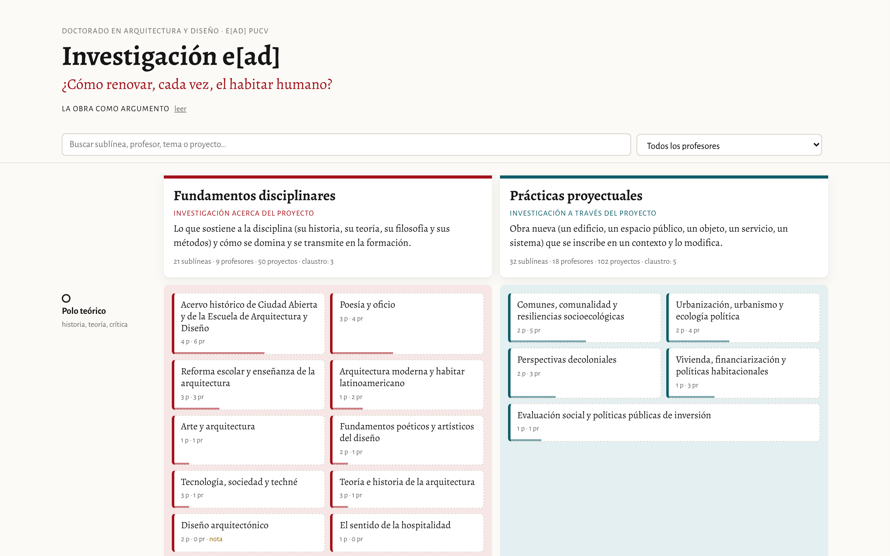

# Investigación e[ad]

Mapa de la investigación del **Doctorado en Arquitectura y Diseño** de la e[ad] PUCV: las dos líneas, sus polos, sus ejes temáticos (sublíneas), las personas que los cultivan y los proyectos 2014-2026, en una sola página.

| | |
|---|---|
| **Sitio** | [eadpucv.github.io/investigacion-ead](https://eadpucv.github.io/investigacion-ead/) |
| **Datos** | [`investigacion-ead.xlsx`](./investigacion-ead.xlsx), la única fuente |
| **Documentos** | [comparación de las líneas](./comparacion-lineas.md) · [líneas de investigación](./lineas-investigacion.md) · [definiciones del programa](./doctorado-programa.md) · [claustro](./propuesta-dos-lineas.md) |



## Las dos líneas

Las líneas se distinguen por el **tipo de contribución**:

- **Fundamentos disciplinares** investiga *acerca del* proyecto. Su contribución es teórico-disciplinar: lo que sostiene a la disciplina (su historia, su teoría, su filosofía y sus métodos) y cómo se domina y se transmite en la formación.
- **Prácticas proyectuales** investiga *a través del* proyecto. Su contribución es obra nueva (un edificio, un espacio público, un objeto, un servicio, un sistema, una herramienta) que se inscribe en un contexto y lo modifica.

Cada línea tiene un **polo teórico** y un **polo proyectual**.

## Cómo se lee la página

La página es un grafo de envolventes anidadas:

- **Las dos líneas** son las grandes envolventes de color (rojo: Fundamentos disciplinares; verde azulado: Prácticas proyectuales).
- Dentro de cada línea, **los polos**: arriba el teórico (borde punteado) y abajo el proyectual.
- Dentro de cada polo, **los ejes temáticos** (sublíneas): las envolventes blancas.
- Dentro de cada eje, **las personas** que lo cultivan. El color de cada persona es el de la línea a la que aporta por su contribución, y el borde negro marca a quienes integran el claustro. Una persona que cultiva varios ejes aparece en cada uno.

Interacción:

- **Pasar el cursor** sobre una persona o un eje muestra su nombre. Sobre una persona, además, se iluminan todas sus apariciones y se unen con una línea punteada.
- **Clic** en un eje, una persona o una línea abre el panel con el detalle: personas y temas, proyectos, claustro.
- **Elegir una persona** en el menú, o **buscar** por eje, persona, tema o título de proyecto, deja visible sólo lo que coincide.
- Rueda o pellizco para acercar; arrastrar para moverse. Cada detalle tiene su propia dirección (por ejemplo `#prof=Anna Braghini`), que se puede compartir.

## Cómo editar los datos

Todo vive en `investigacion-ead.xlsx`. Se edita en Excel, Numbers o LibreOffice; al guardar, hacer commit y push, el sitio se actualiza solo. La primera hoja (*Léeme*) explica las reglas.

| Hoja | Una fila por… | Columnas |
|---|---|---|
| Programa | campo | pregunta, título y texto del sello |
| Líneas | línea | nombre, modo, definición breve, pregunta, área del Magíster que prolonga, laboratorios, descripción |
| Sublíneas | sublínea | nombre, **línea** y **polo** (menús), notas |
| Profesores | profesor | nombre, **línea** según su contribución, **claustro** (sí/no), perfil |
| Temas | vínculo profesor ↔ sublínea | profesor y sublínea (menús), tema |
| Proyectos | proyecto | año, título, profesores (separados por `;`), sublínea (menú), revisar |

No hay códigos internos: todo se referencia por nombre. **Para mover una sublínea de línea o de polo basta cambiar sus dos menús.** La línea y el polo de un proyecto se deducen de su sublínea. Si un nombre no coincide entre hojas, la página lo avisa al pie («avisos de la planilla»).

## Documentos generados

`lineas-investigacion.md` y `comparacion-lineas.md` se regeneran desde la planilla:

```bash
cd tools
python3 build_doc.py
python3 build_comparacion.py
```

La productividad por profesor (publicaciones y proyectos 2014-2026) está en `data/productividad.csv` y sólo se usa en la comparación.

## Ver el sitio localmente

```bash
python3 -m http.server 8000
# abrir http://localhost:8000
```

## Estructura

```
index.html                 página única
app.js                     lee la planilla (SheetJS) y dibuja el grafo (D3)
style.css                  estilos
investigacion-ead.xlsx     datos
data/productividad.csv     productividad por profesor (para la comparación)
tools/                     generadores de documentos (datos.py, build_doc.py, build_comparacion.py)
archivo/                   versión anterior: grafo con tres vistas, planilla de 20 hojas, specs, scripts
```

La versión anterior (grafo de fuerzas con tres superficies y la planilla `mad-map-data-v2.xlsx`) quedó en `archivo/` y en el historial de git.
