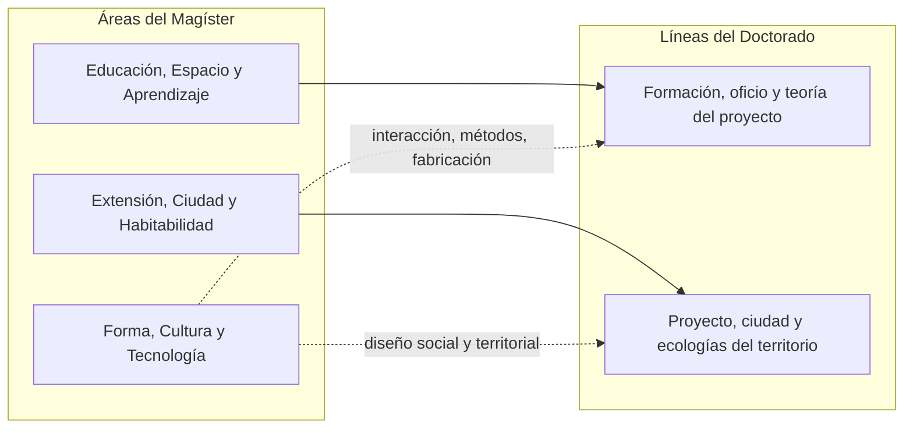
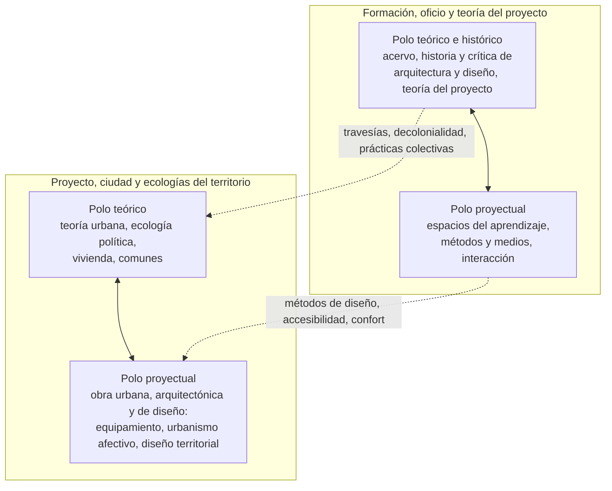
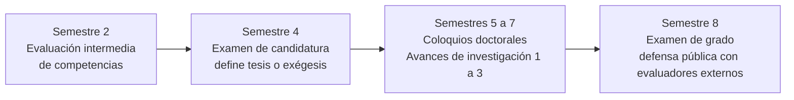

# Doctorado en Arquitectura y Diseño: definiciones conceptuales

**Escuela de Arquitectura y Diseño, Pontificia Universidad Católica de Valparaíso**
Documento de trabajo, septiembre de 2026. Toma del Programa Formativo (Entrega 3, 7 de septiembre de 2026)[^fuente] la caracterización del grado, los objetivos, el perfil de ingreso, el perfil de graduación y sus competencias, las estrategias formativas y el sistema de seguimiento, y reemplaza sus cuatro líneas de investigación por las dos que aquí se definen.

[^fuente]: "Programa Formativo Doctorado en Arquitectura y Diseño, Entrega 3, 070926", formato de la Dirección de Desarrollo Curricular y Formativo de la PUCV. Las secciones 2.1, 2.2, 2.4, 2.5, 2.7, 2.8, 3.1, 3.4, 3.5 y 4.1 se resumen o citan aquí; la sección 2.3 (líneas de investigación) se reemplaza íntegramente. Los datos de sublíneas, laboratorios, modos y cuerpo académico provienen de `mad-map-data-v2.xlsx`, migrado al régimen de dos líneas con `tools/migrate_dos_lineas.py`.

## Caracterización del grado

El Doctorado en Arquitectura y Diseño es un programa académico inscrito en los campos disciplinares de la arquitectura y del diseño, con una vocación explícita por la investigación en el campo proyectual, entendida como la conjunción de la teoría, la praxis y la poiesis en la generación de conocimiento original. Se sitúa en los fundamentos de la Escuela de Arquitectura y Diseño (e[ad]), cuya identidad de más de setenta años se construye en torno a la relación entre la poesía y la arquitectura y el diseño, con una mirada situada en el continente americano, las Travesías como experiencia de obra, la Ciudad Abierta como obra colectiva y la observación como modo de aprehender.

El programa dialoga con marcos internacionales de referencia (EQF nivel 8, Tuning América Latina, la normativa CNA Chile y los marcos escandinavos y anglosajones para la investigación basada en la práctica) y forma investigadoras e investigadores capaces de generar conocimiento original con vocación pública, vinculados al territorio, a comunidades y a obras concretas, y preparados para la vida académica con énfasis explícito en la dimensión docente y formativa. Se concibe en continuidad con el Magíster en Arquitectura y Diseño, que es su programa raíz, y sus dos líneas de investigación prolongan dos de las tres áreas de ese magíster.

## Objetivos

El objetivo general es formar investigadoras e investigadores con autonomía intelectual y pensamiento crítico, capaces de generar conocimiento original y aplicado en la frontera del campo disciplinar, articulando teoría, praxis y poiesis mediante la creación-investigación. El programa sitúa esta formación en la región de Valparaíso y en el horizonte cultural americano, para fortalecer de manera verificable la disciplina, la vida académica y la vinculación con comunidades y territorios, permitiendo a sus graduadas y graduados desempeñarse en instituciones de educación superior, centros de investigación y organismos públicos y privados.

Los objetivos específicos son cuatro. El primero es desarrollar en las y los doctorandos la conducción autónoma de la creación-investigación, articulando la observación, la obra y el estudio colectivo como medios de producción de conocimiento, para sostener una pregunta abierta como operación central del trabajo doctoral y fundamentar un posicionamiento disciplinar propio, verificable en una tesis o exégesis. El segundo es fortalecer capacidades de investigación avanzada, a través del dominio crítico de múltiples enfoques teórico-epistemológicos, para configurar y justificar marcos metodológicos pertinentes y situados, abordando con rigor los problemas complejos del habitar. El tercero es articular la investigación doctoral con comunidades, territorios e instituciones mediante el trabajo de campo y proyectos de investigación aplicada con contrapartes públicas, sociales o productivas, para su incidencia documentada en las prácticas del habitar y en las políticas públicas del entorno construido. El cuarto es consolidar la productividad académica y la proyección internacional de las y los graduados mediante cotutelas, pasantías internacionales y la publicación de sus resultados en medios de corriente principal, para su incorporación como pares a las comunidades del campo disciplinar.

Las dos líneas de investigación responden a estos objetivos de manera diferenciada. La línea Proyecto, ciudad y ecologías del territorio, que investiga a través del proyecto, es el cauce principal del tercer objetivo, la articulación con comunidades, territorios e instituciones; la línea Formación, oficio y teoría del proyecto, que investiga acerca del proyecto, es el cauce principal del énfasis docente y formativo del objetivo general y del posicionamiento disciplinar del primero. Ambas comparten el segundo y el cuarto, y en ambas caben por igual la arquitectura y el diseño.

## Sello: la obra como argumento

El programa forma investigadores para quienes la obra es origen y prueba de la tesis. Esa obra, sea edificada, fabricada, escrita o dibujada, vale como argumento por sí misma, y el discurso doctoral se construye para hacerla legible y discutible. La pregunta que esa obra está llamada a argumentar es la que el programa hace suya: cómo reinventar el habitar humano.

El programa responde a esa pregunta desde el habitar poético que funda a la Escuela: la palabra poética como origen del proyecto, la observación como modo de aprehender, la travesía y la Ciudad Abierta como obra. Ese fundamento no es propiedad de una línea sino del programa entero, y permea por igual a la arquitectura y al diseño. Las dos líneas del doctorado investigan ese habitar de dos maneras: una acerca del proyecto, su formación, su oficio y su teoría; la otra a través del proyecto, sobre la ciudad, el territorio y sus ecologías. Cada línea lleva dentro su contraparte, teórica o proyectual. Doctorarse aquí es haber producido una obra capaz de sostener esos principios al ponerse a prueba y, en su mejor versión, capaz de reformularlos.

## Las dos líneas de investigación

El programa cuenta con dos líneas de investigación, en coherencia con sus objetivos, su perfil de graduación y la productividad de su claustro. Cada una prolonga un área del Magíster en Arquitectura y Diseño, de modo que el tránsito entre ambos niveles sea legible para el estudiante y para el evaluador, y cada una se sustenta en académicos con grado de doctor, trayectoria activa en proyectos y vinculación con laboratorios y redes[^claustro]. El área Forma, Cultura y Tecnología del Magíster no origina línea: sus temas (diseño de interacción, accesibilidad, métodos, fabricación, diseño social y territorial) se distribuyen entre los polos proyectuales de ambas líneas.

[^claustro]: La composición del claustro, el cotejo de productividad contra los criterios del área y las configuraciones alternativas están en `propuesta-dos-lineas.md`. La configuración recomendada sostiene la línea Proyecto, ciudad y ecologías del territorio con Mercado y Marín (polo teórico) y Di Felice y Salgado (polo proyectual), y la línea Formación, oficio y teoría del proyecto con Braghini y Reyes (polo teórico) y K. Exss (polo proyectual), con Ursula Exss y Chicano como incorporaciones próximas.

Las dos líneas se distinguen por la posición del proyecto en la investigación. Formación, oficio y teoría del proyecto investiga acerca del proyecto de arquitectura y de diseño: el proyecto es su objeto. Proyecto, ciudad y ecologías del territorio investiga a través del proyecto: el proyecto es su método y la ciudad y el territorio son su objeto. Se relacionan como el yin y el yang: la primera es de vocación teórica, histórica y formativa, pero contiene un polo proyectual; la segunda es de vocación proyectual y territorial, pero contiene un polo teórico. En ambas caben la arquitectura y el diseño, porque el proyecto (el edificio, el objeto, el sistema, la intervención) es lo que las dos disciplinas tienen en común en la e[ad]. La contraparte no es un apéndice sino la condición de que la línea produzca obra y argumento a la vez, que es lo que el sello exige.

### Formación, oficio y teoría del proyecto

*Modo de investigar:* investigación acerca del proyecto.

*Prolonga:* el área Educación, Espacio y Aprendizaje del Magíster.

*Definición.* Esta línea toma el proyecto de arquitectura y de diseño como objeto de investigación: cómo se forma quien proyecta, cómo se ejerce el oficio y desde qué teoría e historia se piensa. Investiga la tradición y el pensamiento que sostienen ambas disciplinas, cómo se actualizan sus categorías y con qué espacios, métodos y medios se enseña y se aprende a proyectar. Es la línea que forma a quienes enseñarán arquitectura y diseño: académicos del oficio capaces de fundar su docencia en una investigación propia, desde el habitar poético que funda a la Escuela. Su nombre prolonga el área Educación, Espacio y Aprendizaje con "formación" en lugar de "educación", para no confundirse con el campo de la Facultad de Educación.

*Pregunta nuclear.* Qué tradición, qué oficio y qué teoría sostienen el proyecto de arquitectura y de diseño, cómo se actualizan sus categorías, y con qué espacios, métodos y medios se enseña y se aprende a proyectar.

*Polo teórico e histórico.* Acoge el acervo de Ciudad Abierta y de la Escuela, la historia y la crítica de la arquitectura moderna y latinoamericana y la historia del diseño, la teoría del proyecto y sus categorías propias (la hospitalidad, el vacío arquitectónico, la palabra poética y la poética del oficio), la relación entre arte, arquitectura y diseño, la reforma escolar y la enseñanza de la arquitectura, y la techné como reflexión epistemológica del diseño. Sus modos de investigar predominantes son la historiografía (fuentes, archivo, genealogías de obra) y la teoría crítica (producción conceptual, ensayo, lectura crítica de prácticas y discursos). Su sostén asociativo es el laboratorio Patrimonio moderno y el Archivo Histórico José Vial Armstrong.

*Polo proyectual.* Acoge los espacios del aprendizaje (la arquitectura como medio didáctico, los espacios educativos y escolares, la estimulación temprana y los contextos vulnerables), los métodos y medios del diseño (métodos de diseño, comunicación visual y exposición material, fabricación digital y modelado paramétrico, máquinas expresivas, saberes técnicos análogos, transferencia tecnológica), y el diseño de interacción, la accesibilidad, la comunicación aumentativa y los sistemas inteligentes como mediación entre las personas y sus entornos. Su modo de investigar predominante es la investigación proyectual: el proyecto, el prototipo o el dispositivo como generador de conocimiento, documentado críticamente. Su sostén asociativo son el Núcleo de Accesibilidad e Inclusión y el Aconcagua Fablab.

*Puente entre los polos.* Las sublíneas Métodos de diseño, Formación en pensamiento y acción creativa y Reforma escolar y enseñanza de la arquitectura son las que reúnen a historiadores, teóricos y proyectistas en torno a la pregunta por cómo se forma un arquitecto o un diseñador.

*Sublíneas.* Treinta y cuatro, once en el polo teórico y veintitrés en el proyectual, registradas en `02_Sublineas` con la columna `polo`.

*Perfil de tesis.* Tesis monográficas de historia, crítica o teoría del proyecto en arquitectura o en diseño a partir de archivos y obras; exégesis cuyo objeto es un dispositivo, un espacio, un sistema o un medio de aprendizaje producido y puesto a prueba; investigaciones sobre pedagogía del proyecto con obra docente como evidencia.

### Proyecto, ciudad y ecologías del territorio

*Modo de investigar:* investigación a través del proyecto.

*Prolonga:* el área Extensión, Ciudad y Habitabilidad del Magíster.

*Definición.* Esta línea toma el proyecto de arquitectura y de diseño como método de investigación, y la ciudad, el territorio y sus ecologías como objeto. Investiga cómo la ciudad y el territorio se construyen, se habitan, se sostienen y se piensan políticamente, y qué proyectos (urbanos, arquitectónicos, de equipamiento, de objetos y de servicios) los transforman. Toma la región de Valparaíso y el continente americano como laboratorio y prolonga el legado de las travesías, donde la obra de arquitectura y de diseño es el modo de conocer el territorio, y de la observación como fundamento del habitar poético. Es la línea por la que el programa interlocuta con el Estado, los gobiernos regionales, los municipios y las organizaciones de la sociedad civil.

*Pregunta nuclear.* Cómo la ciudad y el territorio se construyen, se habitan, se sostienen y se piensan políticamente, y qué proyectos de arquitectura y de diseño los transforman.

*Polo teórico.* Acoge la teoría urbana, la urbanización y la ecología política, la vivienda y sus crisis contemporáneas (financiarización, acceso, políticas habitacionales), los comunes y las resiliencias socioecológicas, las perspectivas decoloniales y la evaluación social de las políticas públicas de inversión. Su modo de investigar predominante es la teoría crítica, con investigación de campo y especulativa (futuros posibles). Su sostén asociativo es el laboratorio Personas y territorios.

*Polo proyectual.* Acoge la intervención sobre el territorio: la adaptabilidad urbana ante riesgos costeros y la adaptación formal ante desastres, la infraestructura, la movilidad y el equipamiento, el patrimonio arquitectónico y natural y su rehabilitación, el urbanismo afectivo, la deriva y la investigación-acción, las prácticas colectivas y la apropiación escénica del espacio público, el mobiliario y la materialidad de la obra, el diseño social y territorial, y el confort y el espacio habitable de las personas. Su modo de investigar predominante es la investigación proyectual con investigación-acción y creación de obra, en arquitectura y en diseño por igual. Su sostén asociativo son los laboratorios Urbanismo afectivo y Personas y territorios.

*Puente entre los polos.* Las sublíneas Perspectivas decoloniales y Prácticas colectivas reúnen a teóricos y proyectistas, y son además el puente con la otra línea a través del acervo de las travesías.

*Sublíneas.* Diecinueve, cinco en el polo teórico y catorce en el proyectual.

*Perfil de tesis.* Tesis de teoría urbana, ecología política o vivienda con trabajo de campo; exégesis cuyo objeto es una intervención urbana, un equipamiento, un objeto o servicio de diseño territorial, o un proceso de investigación-acción con comunidades; investigaciones con incidencia documentada en instrumentos de política pública.

### Continuidad y aseguramiento de calidad de las líneas

Cada línea es coordinada por un académico del claustro designado por el Comité Académico, con registro formal en el Reglamento del Doctorado. Esa figura vela por la continuidad de la productividad investigativa, la formación de tesistas y la articulación con redes externas, y por el equilibrio entre los dos polos de su línea. El claustro completo se evalúa cada cinco años conforme a los criterios CNA y al Reglamento Académico del Postgrado de la PUCV. La continuidad se asegura mediante la vinculación con los laboratorios y núcleos activos, la producción regular de publicaciones indexadas y la postulación periódica a fondos concursables. El mapa de investigación[^mapa] es el instrumento con que el programa hace visible esa continuidad: cada sublínea, cada laboratorio y cada académico quedan trazados a una línea y a un polo.

[^mapa]: Visualización en https://eadpucv.github.io/investigacion-ead/ (superficies Cartografía, Narrativa y Exploración), alimentada por `mad-map-data-v2.xlsx`. El documento `lineas-investigacion.md` se regenera desde la misma planilla con `python3 tools/build_doc.py`.

## Relación con el Modelo Educativo

El programa se formula en coherencia con el Modelo Educativo de la PUCV, con el Plan de Desarrollo Estratégico Institucional 2023-2029 y con el Plan de Concordancia de la Escuela 2023-2029. La misión institucional, que nombra el cultivo de los distintos saberes y la creación como forma de generar conocimiento, admite un saber proyectual que investiga produciendo obra; la conjunción de teoría, praxis y poiesis es la manera en que el programa participa de esa búsqueda. La visión de una universidad de vocación pública que dialoga con la sociedad se inscribe en las dos líneas: la línea que investiga acerca del proyecto, en la formación de quienes formarán; la línea que investiga a través del proyecto, en los problemas del habitar imposibles de estudiar fuera del territorio y al margen de las comunidades.

Las tres ideas matrices del Modelo se traducen en decisiones curriculares. La persona en el centro, en un trayecto singular para cada estudiante, definido por su pregunta y su obra, acompañado por un director de tesis y un comité doctoral. La relación entre profesores y estudiantes como motor, en el estudio en ronda, dispositivo histórico de la e[ad] que el programa mantiene en los seminarios y formaliza en el coloquio doctoral. La unidad de las etapas formativas, en la articulación estructural con el Magíster en Arquitectura y Diseño, de la que las dos líneas son la expresión más directa. El Plan de Concordancia de la Escuela define como su proyecto estratégico consolidar la investigación para proyectar el programa de doctorado y compromete, entre otros aportes, la contratación de seis profesores asociados entre 2024 y 2027.

## Perfil de ingreso

Quien postula tiene formación avanzada en arquitectura, diseño o disciplinas afines, una trayectoria de investigación, creación o práctica profesional de vocación proyectual, y busca producir conocimiento original a partir del trabajo con contextos reales, comunidades y obras. Se exige el grado de magíster o equivalente en arquitectura o diseño; pueden postular quienes provengan de artes, ingeniería, geografía, urbanismo, ciencias sociales u otras disciplinas cuya pertinencia se califica en la admisión. Se esperan el dominio de los marcos teóricos centrales de la arquitectura y el diseño y de los métodos de investigación cualitativa y proyectual; el dominio del español y un inglés suficiente para la lectura especializada, que el programa eleva al nivel B2 antes del examen de grado; la capacidad de formular problemas de investigación, de comunicar en contextos académicos y de observar, registrar y documentar críticamente el trabajo proyectual; el manejo de la representación digital, la gestión bibliográfica y los entornos colaborativos en línea; y la disposición al trabajo colectivo del taller y del estudio en ronda, la apertura interdisciplinaria, la sensibilidad para articular el trabajo proyectual con las dimensiones poéticas y fenomenológicas de la tradición de la Escuela, y la vocación pública y el compromiso con la dimensión territorial de la disciplina.

El anteproyecto de investigación doctoral se inscribe en una de las dos líneas del programa, con indicación de su pertinencia, originalidad y viabilidad, y el director de tesis se designa en el mismo proceso de admisión.

## Perfil de graduación

La persona graduada del Doctorado en Arquitectura y Diseño es una investigadora autónoma, capaz de formular preguntas inéditas en la frontera del campo disciplinar, contribuyendo de manera verificable al conocimiento. Comprende el investigar como un acto de apertura, creación y compromiso con el conocimiento, desplegado mediante un proceso que le permite instaurar un origen desde donde develar los fenómenos observados. Reconoce el proyecto como una vía de investigación e integra en ella el conocimiento teórico, metodológico y técnico con rigor académico. Actúa con integridad y responsabilidad ética en todas las fases del proceso creativo e investigativo, y comunica sus aportes en los formatos propios del campo (obras, exposiciones, proyectos y publicaciones) con vocación pública y proyección internacional. Al egresar, está capacitada para conducir investigaciones y creaciones doctorales originales, participar de redes académicas nacionales e internacionales y responder con pertinencia al impacto de su obra en los espacios y comunidades que la reciben[^validacion].

[^validacion]: El perfil fue validado en agosto de 2026 por 51 informantes (académicos, estudiantes potenciales e informantes externos) con un índice de validez de contenido de 0,908. El único ítem bajo el criterio de suficiencia fue el de lenguaje específico de la disciplina, lo que motivó una revisión léxica sin cambio conceptual. Un informante interno y uno externo objetaron la afirmación de que el diseño es "a la vez, método y resultado", reparo que este documento recoge al hablar del proyecto como vía de investigación.

### Competencias

El programa declara cinco competencias, formuladas en el arco propio del hacer investigativo-proyectual: posicionarse en el campo, diseñar el método, conceptualizar el aporte, configurar la obra y evaluar su impacto. Todas integran el componente ético de la conducta responsable en investigación.

| Competencia | Enunciado |
|---|---|
| C1. Posicionamiento e investigación disciplinar | Formula preguntas de investigación situadas y originales, articulando el análisis crítico de paradigmas con la intuición disciplinar, e identificando su sentido dentro de las comunidades y sus tradiciones, para fundar un posicionamiento epistemológico pertinente y responsable. |
| C2. Diseño metodológico de la investigación | Diseña marcos metodológicos pertinentes a su investigación para constituir un campo de fenómenos complejos y producir conocimiento riguroso y transferible hacia la comunidad disciplinar. |
| C3. Conceptualización proyectual (poiesis) | Conceptualiza el aporte de su investigación como conocimiento original, articulando sus dimensiones teóricas, metodológicas, técnicas y proyectuales en una formulación singular y coherente, en diálogo con las problemáticas contemporáneas del habitar. |
| C4. Praxis y configuración proyectual | Configura obras, modelos e intervenciones a través de una praxis crítica y reflexiva, que articula decisiones formales, técnicas y materiales para constituir evidencia verificable y publicable. |
| C5. Evaluación e impacto en las comunidades | Rinde cuenta del valor y la pertinencia de su investigación con integridad científica en las comunidades, instituciones y ecosistemas que la reciben, mediante procesos reflexivos, participativos y transparentes, para que su conocimiento incida en las prácticas del habitar y movilice los debates disciplinares y públicos. |

Las dos líneas exigen las cinco competencias, pero con acentos distintos. En Formación, oficio y teoría del proyecto el peso recae en C1 y C3, porque investigar acerca del proyecto se juega en el posicionamiento frente a una tradición y en la conceptualización del aporte; en Proyecto, ciudad y ecologías del territorio el peso recae en C4 y C5, porque investigar a través del proyecto se juega en la configuración de una obra y en la rendición de cuenta ante quienes la reciben.

## Estrategias formativas

El programa opera con cuatro estrategias didácticas activas. El estudio en ronda y el seminario crítico gobiernan el tramo de fundamentación y fundan la capacidad de situar la propia investigación en las tradiciones del campo. El aprendizaje basado en proyectos y la investigación basada en la práctica constituyen la estrategia central: el doctorando conduce su investigación produciendo obra, prototipos o intervenciones que documenta críticamente. Los estudios de caso y el trabajo de campo (estudios longitudinales, etnografías proyectuales, análisis fenomenológicos del lugar, prácticas de codiseño) son la vía por la que el programa realiza la vinculación con el medio como relación recíproca. El coloquio doctoral es la instancia formal en que el doctorando expone su avance ante el claustro y su comité, recibe crítica de pares y la recoge en acta.

Los tipos de actividad son la cátedra, el taller (columna vertebral del programa), el seminario (con el Seminario Central recorriendo cinco semestres como hilo longitudinal que articula poesía, oficio e investigación) y el coloquio doctoral. Dos actividades optativas y presenciales completan el trayecto sin ser asignaturas: la travesía de investigación, estadía de campo de dos a cuatro semanas en territorios y comunidades del continente americano, y la práctica docente supervisada, mediante ayudantías en el pregrado y el magíster de la Escuela. La travesía es especialmente afín a la línea Proyecto, ciudad y ecologías del territorio; la práctica docente lo es a Formación, oficio y teoría del proyecto, aunque ninguna de las dos queda reservada a una línea.

El programa se imparte en modalidad semipresencial sincrónica, en jornada parcial equivalente a tres cuartos de jornada completa, en régimen semestral de ocho semestres con 20 créditos PUCV (30 SCT) por semestre. Los talleres, seminarios, travesías, trabajo de campo y coloquios son presenciales; los seminarios disciplinares avanzados, las cátedras de invitados, las tutorías y las sesiones de comité operan en sincronía remota, lo que hace viable la cotutela y la incorporación de doctorandos de otras regiones. La wiki Casiopea recibe el trabajo doctoral en curso y aporta la evidencia del proceso proyectual que un informe escrito no recoge por completo.

## Trayecto y sistema de seguimiento

El plan organiza un trayecto de cuatro años en ocho semestres, concebido para que el doctorando avance desde el posicionamiento disciplinar inicial hasta la producción autónoma de una contribución original. Cuatro lógicas longitudinales lo atraviesan: fundamentación y posicionamiento (primer año), formación metodológica (del primero al octavo semestre), praxis proyectual (optativos del tercer y cuarto semestre, coloquios del quinto al séptimo) e investigación doctoral (los ocho semestres, en Seminario de tesis 1 y 2, Proyecto de tesis 1 y 2 y Tesis doctoral 1 a 4). Los tres espacios optativos del tercer y cuarto semestre (metodológico, proyectual y de materialización) permiten al doctorando ajustar su itinerario a la línea en que inscribe su tesis y al método que su investigación requiere.

El sistema de seguimiento se organiza en hitos formales, cada uno situado en una asignatura obligatoria y cerrado con un acta. La evaluación intermedia de competencias, al cierre del segundo semestre, mide la distancia recorrida desde el anteproyecto de admisión hasta un problema de investigación situado y original, y atiende la pertinencia del problema respecto de la línea en que se inscribe. El examen de candidatura, al cierre del cuarto semestre, es el hito central: confiere la condición de candidato doctoral, habilita el paso a la fase de tesis y fija la modalidad del trabajo final. Los coloquios doctorales del quinto, sexto y séptimo semestre son la instancia pública en que el doctorando somete lo producido al examen de una comunidad que no lo dirige. El examen de grado, en el octavo semestre, es la defensa pública ante una comisión con evaluadores externos nacionales e internacionales.

El trabajo final admite dos formas. La tesis es un documento monográfico que expone la investigación completa y sostiene por escrito la contribución original. La exégesis corresponde a la investigación basada en la práctica: la contribución se constituye por una obra, prototipo o intervención producida durante el trayecto, acompañada de un documento crítico-reflexivo que la sitúa en el campo, explicita el método proyectual, interpreta las decisiones formales, técnicas y materiales, y formula el conocimiento que la obra pone a prueba; obra y documento se entregan y evalúan como una unidad. Ambas modalidades responden a la misma exigencia de originalidad, rigor y contribución, y ambas están disponibles en las dos líneas, aunque la tesis monográfica sea la forma más frecuente en el polo teórico y la exégesis en el proyectual.

La graduación exige, además de los hitos, acreditar el nivel B2 en lengua extranjera, contar con un artículo aceptado en una revista indexada de corriente principal, tener completas las actas semestrales de avance y haber sometido la tesis o exégesis a la revisión de similitud y de uso de herramientas de inteligencia artificial. La aprobación bioética se obtiene antes de iniciar el trabajo de campo intensivo cuando la investigación involucra personas, lo que en la línea Proyecto, ciudad y ecologías del territorio será la regla y no la excepción.

## Integridad académica

El programa incorpora la Política de Integridad Académica PUCV como componente formativo transversal y obligatorio. Las cinco competencias integran el componente ético conforme a los principios de la conducta responsable en investigación, y dos asignaturas lo hacen efectivo en momentos sucesivos: Ética, bioética e impacto de la investigación, en el segundo año, que introduce los estándares éticos, el resguardo de consentimientos y datos, la citación y la trazabilidad de fuentes, y el uso declarado y proporcionado de herramientas de inteligencia artificial; y Comunicación científica, vinculación e impacto, en el octavo semestre, que extiende ese marco al momento en que la investigación se hace pública y a la restitución de lo investigado a las comunidades e instituciones que lo reciben, de modo que la vinculación opere como relación recíproca y no como extracción.
