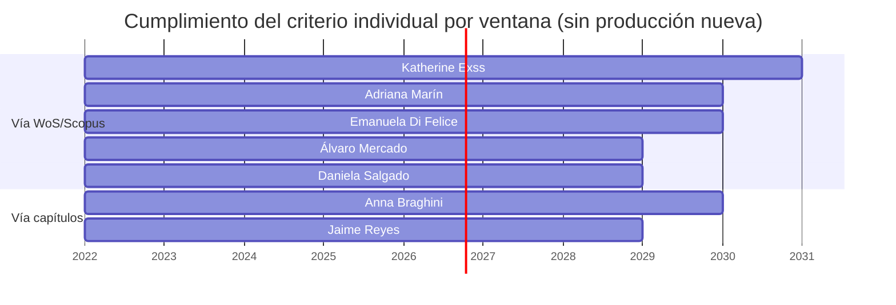
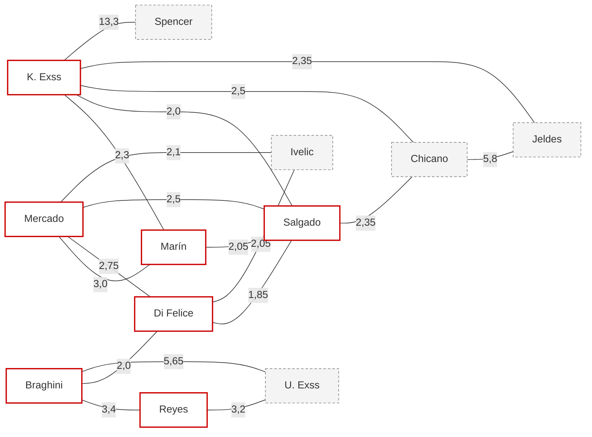
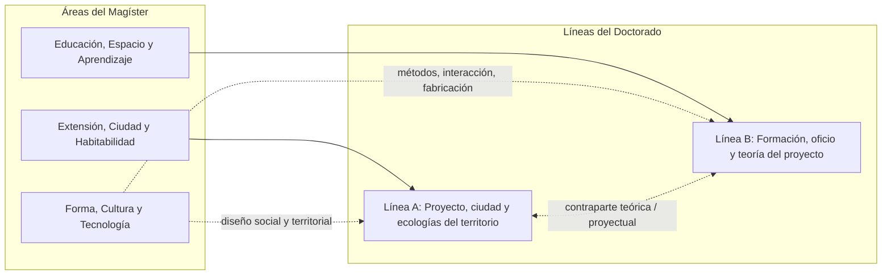
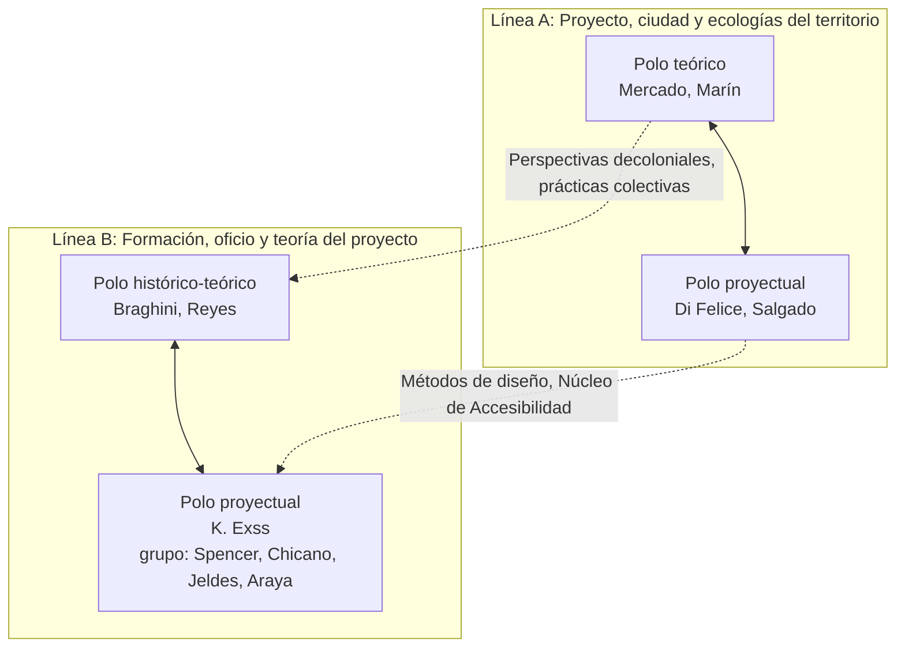

# De cuatro a dos líneas: claustro y configuración del Doctorado

**Doctorado en Arquitectura y Diseño**
*Escuela de Arquitectura y Diseño, Pontificia Universidad Católica de Valparaíso*
Documento de trabajo, septiembre de 2026

## Propósito

Este documento coteja el cuerpo académico contra los criterios de pertenencia al claustro y, sobre esa base, propone la reducción de las cuatro líneas troncales vigentes[^lineas4] a dos líneas de investigación que prolongan las áreas Extensión, Ciudad y Habitabilidad y Educación, Espacio y Aprendizaje del Magíster. Para cada línea se proponen nombres, se identifican los académicos que la sostienen, los grupos de estudio por afinidad y los modos de investigar que cada grupo emplea. La afinidad temática entre los miembros del claustro se calcula desde los datos del mapa de investigación y se usa para justificar las configuraciones alternativas que el comité deberá elegir.

[^lineas4]: Las cuatro líneas vigentes, tal como están registradas en `mad-map-data-v2.xlsx` y descritas en `lineas-investigacion.md`, son: Personas, interacción y sistemas inclusivos (LIN-01); Habitar, infraestructura y ecologías territoriales (LIN-02); Teoría e historia de la arquitectura y el diseño (LIN-03); y Oficio, tecnologías y aprendizaje proyectual (LIN-04).

Los criterios del área para pertenecer al claustro son dos. El criterio individual exige 3 publicaciones WoS/Scopus o 4 capítulos de libro con referato externo en la ventana de cinco años. El criterio grupal, de carácter orientador, pide que al menos el 60% del claustro tenga proyectos adjudicados. A ellos se suman dos condiciones de base: contar con el grado de doctor y ser profesor de planta de la Escuela (los profesores externos no integran el claustro). El mínimo estructural del doctorado es de 2 académicos por línea, sin tope superior.

## Fuentes

Los conteos de productividad provienen de la planilla compartida de productividad del cuerpo académico[^planilla], que registra artículos WoS/Scopus, otras indexaciones, artículos sin indexación, capítulos de libro con referato, proyectos externos (Fondecyt e IR/COI de otros fondos) y proyectos internos PUCV en cinco ventanas móviles de cinco años (2022-2026 a 2026-2030). Los perfiles temáticos, laboratorios y modos de investigar provienen de las hojas `07_Investigadores`, `08_Temas`, `12_Investigador_Lab`, `13_Investigador_Modo` y `18_Proximidad_Tematica` del archivo `mad-map-data-v2.xlsx`, y las autodeclaraciones de naturaleza de la investigación provienen del formulario Perfil de Investigación y Creación de 2024.

[^planilla]: Hoja de cálculo "Productividad", cinco ventanas móviles. Los totales por columna de la ventana 2022-2026 (50 WoS/Scopus, 15 otras indexaciones, 24 sin indexación, 43 capítulos, 3 Fondecyt IR, 6 Fondecyt COI, 11 otros IR, 7 otros COI, 48 proyectos PUCV) fueron reproducidos desde la transcripción usada aquí, lo que verifica que los datos individuales se copiaron sin error. La planilla marca a Alfred Thiers y Marcelo Araya como "sin ORCID", de modo que sus ceros pueden reflejar ausencia de registro y no ausencia de producción. Sylvia Arriagada y Felipe Igualt figuran en el mapa de investigación o en el formulario 2024 pero no aparecen en la planilla de productividad; no fue posible cotejarlos.

## Cotejo del claustro

### Quiénes cumplen hoy

En la ventana vigente 2022-2026 cumplen el criterio de productividad ocho académicos. Herbert Spencer cumple con holgura (14 WoS/Scopus) pero no tiene aún el grado de doctor, por lo que queda fuera del claustro y se considera aquí como integrante de grupos de estudio, con incorporación natural al claustro al graduarse[^spencer]. El claustro elegible queda en siete. Cinco cumplen por la vía WoS/Scopus (K. Exss, Marín, Di Felice, Mercado, Salgado; Di Felice y Marín cumplen además por capítulos) y dos únicamente por la vía de capítulos con referato (Reyes y Braghini). La tabla registra la producción de la ventana vigente y la trayectoria del cumplimiento en las ventanas siguientes, calculada con los datos ya registrados, es decir, suponiendo que no se agregue producción nueva[^trayectoria].

[^spencer]: La condición de grado de doctor se aplicó aquí sólo a Spencer, por indicación expresa. Conviene confirmar que los siete restantes la cumplen antes de cerrar el claustro.

[^trayectoria]: La lectura de las ventanas futuras es una proyección conservadora: muestra en qué año un académico dejaría de cumplir si no publicara nada más. Su utilidad es señalar dónde la sostenibilidad del claustro depende de producción que todavía no existe.

| Académico | WoS/Scopus | Capítulos | Cumple 2022-2026 | Proyecto externo | Fondecyt | Sigue cumpliendo hasta |
|---|---:|---:|:-:|:-:|:-:|---|
| Katherine Exss | 10 | 2 | Sí | Sí (COI, otros COI) | Sí | 2026-2030 |
| Adriana Marín | 7 | 4 | Sí | Sí (Fondecyt COI) | Sí | 2025-2029 |
| Emanuela Di Felice | 4 | 4 | Sí | No (5 PUCV) | No | 2025-2029 |
| Anna Braghini | 1 | 6 | Sí | No (3 PUCV) | No | 2025-2029 |
| Álvaro Mercado | 4 | 1 | Sí | Sí (Fondecyt IR) | Sí | 2024-2028 |
| Daniela Salgado | 4 | 1 | Sí | Sí (Fondecyt IR y COI) | Sí | 2024-2028 |
| Jaime Reyes | 0 | 7 | Sí | Sí (otros IR) | No | 2024-2028 |
| Herbert Spencer (sin grado de doctor) | 14 | 2 | Sí, fuera del claustro | Sí (COI, otros IR) | Sí | 2026-2030 |

El criterio grupal se satisface en el conjunto de los siete: 5 de 7 (71%) tienen proyecto externo adjudicado y 4 de 7 (57%) tienen Fondecyt, sea como IR o como COI. Si el criterio se leyera restringido a Fondecyt como investigador responsable, sólo Mercado y Salgado lo cumplirían y la orientación del 60% no se alcanzaría con ninguna configuración posible; conviene por tanto fijar con el área que "proyecto adjudicado" incluye la coinvestigación y los fondos externos no Fondecyt[^proyectos].

[^proyectos]: La planilla distingue Fondecyt (IR, COI), otros fondos externos (IR, COI) y proyectos internos PUCV. Este documento adopta como lectura por defecto "proyecto externo adjudicado, como IR o COI", y reporta la lectura restringida a Fondecyt como sensibilidad. Los proyectos internos PUCV no se contabilizan para el criterio grupal, aunque se mencionan porque muestran actividad de investigación en curso (Di Felice, Mercado y Salgado acumulan 5, 7 y 7 respectivamente).

### Quiénes están en vía de cumplir

Un segundo grupo queda a una publicación del umbral. Por la vía de capítulos, Ursula Exss, Iván Ivelic, Arturo Chicano y Andrés Garcés tienen 3 capítulos con referato y necesitan uno más (U. Exss e Ivelic podrían alternativamente sumar dos WoS/Scopus al que ya tienen). Sergio Baeriswyl tiene 2 WoS/Scopus, pero es profesor externo y no puede integrar el claustro; se lo considera sólo como integrante de grupo de estudio. Juan Carlos Jeldes está a dos pasos (1 WoS, 2 capítulos) pero tiene proyectos externos vigentes hasta 2030 (1 IR, 2 COI), lo que lo hace un candidato razonable a mediano plazo.

| Académico | WoS/Scopus | Capítulos | Le falta | Proyecto externo |
|---|---:|---:|---|:-:|
| Ursula Exss | 1 | 3 | 1 capítulo o 2 WoS | Sí (Fondecyt COI, otros IR y COI) |
| Iván Ivelic | 1 | 3 | 1 capítulo o 2 WoS | No (5 PUCV) |
| Arturo Chicano | 0 | 3 | 1 capítulo o 3 WoS | No |
| Andrés Garcés | 0 | 3 | 1 capítulo o 3 WoS | Sí (otros IR) |
| Juan Carlos Jeldes | 1 | 2 | 2 capítulos o 2 WoS | Sí (otros IR y COI) |

El resto del cuerpo académico está lejos del umbral en la ventana vigente: Óscar Andrade (0 y 0, pero con Fondecyt IR vigente hasta 2030, del que cabe esperar producción), David Luza (1 y 1), Lorena Herrera (0 y 1, con proyecto externo IR), Rodrigo Saavedra (0 y 0, con proyecto externo IR), Jorge Ferrada, Michèle Wilkomirsky, Alfred Thiers y Marcelo Araya (0 y 0; los dos últimos sin ORCID registrado).

### Sostenibilidad del claustro en el tiempo

La proyección por ventanas muestra el problema estructural: con la producción ya registrada, el claustro de siete baja a cuatro en 2025-2029 (salen Mercado, Reyes y Salgado) y a una sola persona en 2026-2030 (K. Exss). El claustro es suficiente para acreditar hoy, pero su continuidad depende de que Mercado, Salgado y Reyes publiquen en los próximos dos años, y de que Braghini, Di Felice y Marín lo hagan en los próximos tres. Esto debería traducirse en un plan de publicación por persona, cosa que las configuraciones de más abajo tienen en cuenta.

## Afinidad temática entre los miembros del claustro

Para que las líneas no sean sólo un reparto administrativo, se midió la afinidad entre los siete miembros del claustro y los seis "en vía" a partir de cuatro señales del mapa de investigación: sublíneas compartidas en `08_Temas`, proximidad declarada entre sus sublíneas en `18_Proximidad_Tematica`, laboratorios compartidos y modos de investigar compartidos[^afinidad]. El resultado es una matriz cuyos valores altos señalan a quienes ya trabajan sobre los mismos objetos o sobre objetos vecinos.

[^afinidad]: Puntaje por par de investigadores: 1,0 por cada sublínea compartida; la suma de las afinidades (0 a 1) de todos los pares de sublíneas distintas de uno y otro registrados en la matriz de proximidad; 0,5 por laboratorio compartido; 0,25 por modo de investigar compartido. Es una medida ordinal, útil para comparar pares, no una métrica absoluta. Recalculable desde el xlsx; el script está reproducido en el repositorio.

Tres hallazgos organizan lo que sigue. Primero, existe un núcleo urbano cohesionado: Mercado y Marín (3,0; comparten la sublínea Urbanización, urbanismo y ecología política y el laboratorio Personas y territorios), Mercado y Di Felice (2,75; laboratorio Urbanismo afectivo, proximidad entre prácticas colectivas, perspectivas decoloniales y ecología política), Mercado y Salgado (2,5; comparten Perspectivas decoloniales), Marín y Salgado (2,05) y Di Felice y Salgado (1,85). Los cuatro forman un bloque con todos sus pares por encima de 1,8.

Segundo, existe un núcleo histórico pequeño pero muy denso: Braghini y Reyes (3,4; comparten el Acervo histórico de Ciudad Abierta y la Escuela, el laboratorio Patrimonio moderno y los dos modos, historiografía y teoría crítica). Su vínculo más fuerte hacia afuera es Ursula Exss (5,65 con Braghini, 3,2 con Reyes), que es la afinidad más alta de toda la matriz entre personas distintas del par Spencer y K. Exss. Es decir, el núcleo histórico está incompleto sin U. Exss.

Tercero, Katherine Exss no tiene afinidad temática con el núcleo histórico (0,25 con Braghini y con Reyes, sólo por compartir el modo de teoría crítica). Sus afinidades están con Marín (2,3; comparten Métodos de diseño), Salgado (2,0; comparten el Núcleo de Accesibilidad e Inclusión), Chicano (2,5) y Jeldes (2,35), y sobre todo con Spencer (13,3; comparten tres sublíneas y dos laboratorios). Con Spencer fuera del claustro, K. Exss queda como la única representante en el claustro del bloque de interacción, accesibilidad y métodos de diseño, y su ubicación en una u otra línea es la decisión principal que distingue las configuraciones.

El grafo muestra sólo los pares con puntaje igual o superior a 1,85 (el piso del bloque urbano). Los nodos con borde rojo son claustro; los punteados están en vía. Se lee de inmediato que hay tres comunidades (urbana, histórica, y de métodos y tecnología) y que la tercera, sin Spencer, tiene en el claustro sólo a K. Exss.

## De las áreas del Magíster a las dos líneas del Doctorado

El Magíster tiene tres áreas: Extensión, Ciudad y Habitabilidad; Educación, Espacio y Aprendizaje; y Forma, Cultura y Tecnología. Las dos líneas nuevas prolongan las dos primeras. La primera línea se hace cargo de la investigación proyectual y urbana: problemas urbanos, planificación, intervenciones arquitectónicas y de equipamiento. La segunda se hace cargo de lo teórico, histórico y formativo, y es la que forma académicos que enseñarán arquitectura y diseño. Como el yin y el yang, cada línea lleva dentro su contraparte: la línea urbana tiene un polo teórico (teoría urbana, ecología política, vivienda) y la línea formativa tiene un polo proyectual (métodos, medios y espacios del aprendizaje del proyecto).

El área Forma, Cultura y Tecnología no origina línea, pero sus académicos no desaparecen: se reparten entre los dos polos proyectuales. La afinidad calculada arriba indica que el diseño social y territorial (Salgado) pertenece sin ambigüedad al bloque urbano, y que el bloque de métodos, interacción y tecnología (K. Exss, Spencer, Chicano, Jeldes, Araya) es un tercer cuerpo que puede leerse como contraparte proyectual de la línea formativa (por su vocación de enseñar diseño y por la sublínea Formación en pensamiento y acción creativa) o como contraparte proyectual de la línea urbana (por Métodos de diseño compartida con Marín y por el Núcleo de Accesibilidad compartido con Salgado). Las configuraciones exploran ambas lecturas.

### Nombres adoptados

Tras la discusión del 8 de septiembre de 2026 se adoptaron dos nombres que expresan el modo de investigar de cada línea y no sólo su campo. La línea A, Proyecto, ciudad y ecologías del territorio, es investigación *a través* del proyecto de arquitectura y de diseño: la ciudad, el territorio y sus ecologías son el campo, y la obra es el modo de conocerlo. La línea B, Formación, oficio y teoría del proyecto, es investigación *acerca* del proyecto: cómo se forma quien proyecta, cómo se ejerce el oficio y desde qué teoría e historia se piensa. Ambas prolongan su área del Magíster de manera reconocible (Extensión, Ciudad y Habitabilidad en la A; Educación, Espacio y Aprendizaje en la B, con "formación" en lugar de "educación" para no rozar a la Facultad de Educación), en ambas caben por igual la arquitectura y el diseño, y el habitar poético que funda a la Escuela permea las dos por la vía del sello y de las definiciones, no de los nombres[^nombres].

[^nombres]: Alternativas descartadas en la discusión: para la A, "Ciudad, territorio y habitabilidad" (sin el proyecto como modo) y "Creación, ciudad y ecologías del territorio"; para la B, "Espacio, aprendizaje y pensamiento del proyecto" y "Educación, espacio y teoría del proyecto" (por la colisión con la Facultad de Educación). "Espacio habitable" se prefiere a "habitabilidad" en las definiciones.

## Línea A: Proyecto, ciudad y ecologías del territorio

*Se hace cargo de:* la investigación proyectual y urbana. Problemas urbanos, planificación, ecología política, vivienda, intervenciones arquitectónicas y de equipamiento, patrimonio y borde costero, prácticas colectivas sobre el territorio.

*Pregunta nuclear:* cómo el territorio se construye, se habita, se sostiene y se piensa políticamente, y qué intervenciones (urbanas, arquitectónicas, de equipamiento) lo transforman.

*Prolonga:* LIN-02 Habitar, infraestructura y ecologías territoriales, prácticamente completa, más la sublínea Diseño social, territorial y patrimonio cultural.

### Polos y académicos del claustro

El polo teórico de la línea lo sostienen Álvaro Mercado (urbanización capitalista y extractiva, ecología política, comunes y resiliencias socioecológicas) y Adriana Marín (teoría urbana, vivienda, financiarización, políticas habitacionales). Ambos investigan predominantemente en el modo de teoría crítica, con investigación de campo, y ambos tienen Fondecyt vigente. El polo proyectual lo sostienen Emanuela Di Felice (urbanismo afectivo, deriva, investigación-acción, reuso del patrimonio en abandono) y Daniela Salgado (diseño social y territorial, artesanía y saberes técnicos, patrimonio cultural material e inmaterial). Ambas combinan investigación proyectual y teoría crítica, y ambas declaran creación de obra como parte de su investigación. Los cuatro forman el bloque más cohesionado del claustro según la matriz de afinidad.

### Grupos de estudio por afinidad

Los grupos reúnen a académicos del claustro con otros del cuerpo académico que comparten laboratorio, sublínea o tema declarado. Cada grupo tiene un modo de investigar predominante.

| Grupo de estudio | Integrantes (claustro en negrita) | Modos de investigar | Sostén |
|---|---|---|---|
| Urbanización, ecología política y vivienda | **Álvaro Mercado**, **Adriana Marín**, Lorena Herrera (evaluación social de políticas públicas), Sergio Baeriswyl (planificación urbana; profesor externo, no elegible para el claustro) | Teoría crítica; investigación de campo; investigación especulativa (futuros posibles) | Lab Personas y territorios |
| Urbanismo afectivo, investigación-acción y reuso del patrimonio | **Emanuela Di Felice**, **Álvaro Mercado**, Andrés Garcés (ciudad-teatro, apropiación escénica del espacio público), Alfred Thiers (mobiliario, actos de la vida urbana), David Luza | Investigación proyectual; investigación-acción; creación de obra | Lab Urbanismo afectivo |
| Infraestructura, equipamiento, patrimonio y borde costero | David Luza (movilidad, infraestructura urbana), Iván Ivelic (equipamiento, naturaleza y patrimonio natural, vivienda colectiva), Jorge Ferrada (patrimonio, ciudad-puerto, frentes marítimos), Felipe Igualt (resiliencia y adaptación ante desastres)[^igualt], **Emanuela Di Felice** | Investigación proyectual; historiografía (Ferrada); investigación de campo | Lab Personas y territorios; Lab Patrimonio moderno (Ferrada) |
| Diseño social, territorial y patrimonio cultural | **Daniela Salgado**, Marcelo Araya (multiterritorialidad, visualización territorial, patrimonio urbano y memoria material), Andrés Garcés, **Adriana Marín** (métodos cualitativos) | Investigación proyectual; teoría crítica; investigación histórica (historia del diseño) | Lab Personas y territorios; Núcleo de Accesibilidad e Inclusión (Salgado) |

[^igualt]: Felipe Igualt declaró en el formulario 2024 las líneas Resiliencia urbana, Arquitectura resiliente y Adaptabilidad de edificaciones afectadas por desastres, adscritas a Extensión, Ciudad y Habitabilidad, pero no figura en `07_Investigadores` ni en la planilla de productividad. Conviene incorporarlo al mapa y cotejar su producción.

### Refuerzos posibles del claustro de la línea A

Ivelic (afinidad 2,05 con Di Felice y 2,1 con Mercado) y Garcés están a un capítulo del umbral. Cualquiera de los dos ampliaría el claustro de la línea sin cambiar su fisonomía. Ivelic reforzaría el polo proyectual (equipamiento e intervención arquitectónica, que hoy sólo cubre indirectamente Di Felice). La planificación urbana, que el enunciado de la línea menciona explícitamente, no tiene hoy a nadie elegible en el claustro: Baeriswyl, que la encarna, es profesor externo, y su aporte queda en el grupo de estudio. Es una brecha que la línea debería declarar y cubrir, sea con producción de Marín y Mercado en esa dirección o con una contratación futura.

## Línea B: Formación, oficio y teoría del proyecto

*Se hace cargo de:* lo teórico, lo histórico y lo formativo. Historia y crítica de la arquitectura moderna, acervo de la Escuela y Ciudad Abierta, categorías del oficio (hospitalidad, vacío, poética), métodos y medios del diseño, espacios y dispositivos del aprendizaje del proyecto. Forma a quienes enseñarán arquitectura y diseño.

*Pregunta nuclear:* qué tradición y qué pensamiento sostienen la disciplina, cómo se actualizan, y con qué métodos, medios y espacios se enseña y se aprende el proyecto.

*Prolonga:* LIN-03 Teoría e historia de la arquitectura y el diseño completa, más las sublíneas de aprendizaje proyectual y de métodos y medios de LIN-04, más las sublíneas de interacción, accesibilidad y sistemas inteligentes de LIN-01.

### Polos y académicos del claustro

El polo histórico y teórico lo sostienen Anna Braghini (historia y crítica de la arquitectura moderna, habitar latinoamericano, arquitectura del Cono Sur, el vacío arquitectónico) y Jaime Reyes (archivo histórico de la Escuela, relación poesía y oficio, hospitalidad, cuaderno pedagógico del taller). Ambos investigan en historiografía y teoría crítica; Reyes declara además creación de obra escultórica y poética. Es el par con mayor afinidad del claustro. El polo proyectual lo sostiene en el claustro Katherine Exss (diseño de interacción y experiencia de usuario, accesibilidad cognitiva, investigación inclusiva y codiseño, métodos de diseño, confort y bienestar), que investiga predominantemente en el modo proyectual y enseña diseño en el pregrado. Herbert Spencer (diseño de interacción y servicios, comunicación aumentativa y alternativa, diseño para la democracia, sistemas inteligentes e inteligencia artificial como material de diseño) integra el grupo de estudio de este polo y es su refuerzo más inmediato una vez obtenido el grado.

La afinidad temática entre los dos polos de esta línea es baja (0,25 entre K. Exss y cada uno de los historiadores). Lo que los une no es el objeto sino la función: ambos polos forman a quienes enseñarán el proyecto, uno desde la tradición y la crítica, otro desde los métodos y los medios. Esa es la contraparte yin y yang de la línea, y el puente temático concreto lo ofrecen la sublínea Métodos de diseño, la sublínea Formación en pensamiento y acción creativa (Chicano, Jeldes) y la sublínea Reforma escolar y enseñanza de la arquitectura (Reyes, U. Exss, Andrade).

### Grupos de estudio por afinidad

| Grupo de estudio | Integrantes (claustro en negrita) | Modos de investigar | Sostén |
|---|---|---|---|
| Historia y crítica de la arquitectura moderna y acervo de la e[ad] | **Anna Braghini**, **Jaime Reyes**, Ursula Exss (teoría e historia de la arquitectura, reforma escolar de 1965), Óscar Andrade (teoría de la arquitectura, comunidades de conocimiento, Fondecyt IR), Sylvia Arriagada (acervo fundacional, heredad creativa del diseño en Travesías), David Luza (experimentación arquitectónica en Ciudad Abierta) | Historiografía; teoría crítica | Lab Patrimonio moderno |
| Poética del oficio, techné y fundamentos del diseño | **Jaime Reyes**, Sylvia Arriagada (poética del oficio, actos poéticos, fundamentos poéticos del diseño), Arturo Chicano (techné y mundo, epistemología del diseño, observación como transmisión de ethos), Juan Carlos Jeldes (tecnología y sociedad, hospitalidad y mediación territorial), Iván Ivelic (proyecto y obra como generación de conocimiento) | Teoría crítica; historiografía; investigación proyectual | Lab Patrimonio moderno; Aconcagua Fablab |
| Espacios educativos y arquitectura como medio didáctico | Ursula Exss (diseño de espacios educativos, arquitectura escolar), Rodrigo Saavedra (espacios de aprendizaje en contextos vulnerables, estimulación temprana, capacidad didáctica de la obra), Óscar Andrade (educación en arquitectura), Michèle Wilkomirsky (pedagogía del diseño), **Jaime Reyes** (medios de aprendizaje) | Investigación proyectual; creación de obra; teoría crítica | Núcleo de Accesibilidad e Inclusión (Saavedra); Lab Patrimonio moderno |
| Métodos de diseño, interacción, accesibilidad y sistemas inteligentes | **Katherine Exss**, Herbert Spencer, Marcelo Araya (interacción como material de diseño, máquinas expresivas, montajes), Michèle Wilkomirsky (diseño de información visual), Juan Carlos Jeldes (fabricación digital, modelado paramétrico, aprendizaje desde el hacer-crear), Arturo Chicano (máquinas expresivas, algoritmos cinéticos), Sylvia Arriagada (diseño editorial y exposición material) | Investigación proyectual; investigación de campo; teoría crítica | Núcleo de Accesibilidad e Inclusión; Aconcagua Fablab |

### Refuerzos posibles del claustro de la línea B

Ursula Exss es el refuerzo decisivo: es la figura que más literalmente encarna el área Educación, Espacio y Aprendizaje (teoría e historia de la arquitectura más diseño de espacios educativos), tiene la afinidad más alta con los dos historiadores del claustro, está a un capítulo del umbral y tiene proyectos externos vigentes hasta 2030. Chicano está también a un capítulo; su afinidad con K. Exss (2,5) y con Jeldes (5,8) lo convierte en el puente natural entre el polo proyectual y el polo teórico, porque su trabajo sobre techné y epistemología del diseño es teoría hecha desde el diseño. Jeldes, a dos pasos, tiene proyectos externos hasta 2030 y con Chicano forma el par más afín del bloque tecnológico.

## Configuraciones del claustro

Todas las configuraciones parten de los siete académicos que cumplen hoy. Difieren en dónde se ubica Katherine Exss, en cuánto se apoyan en los "en vía" y en cómo se lee la afinidad.

### Configuración A: por función, cuatro y tres (recomendada)

| Línea | Polo teórico | Polo proyectual | Proyecto externo | Fondecyt |
|---|---|---|---:|---:|
| Proyecto, ciudad y ecologías del territorio | Mercado, Marín | Di Felice, Salgado | 3 de 4 (75%) | 3 de 4 (75%) |
| Formación, oficio y teoría del proyecto | Braghini, Reyes | K. Exss | 2 de 3 (67%) | 1 de 3 (33%) |

La línea A queda con su bloque afín completo y con dos por polo. La línea B cumple el mínimo con holgura y el 60% de proyectos externos, y su polo proyectual queda representado por K. Exss, con Spencer, Chicano, Jeldes y Araya en el grupo de estudio. Es la configuración que mejor responde al enunciado de las dos líneas (la B forma a quienes enseñan arquitectura y diseño, y K. Exss es la única del claustro que enseña diseño). Su punto débil es que la línea B se sostiene por función y no por afinidad temática, y que su polo proyectual tiene una sola persona del claustro. Refuerzos: U. Exss y Chicano, ambos a un capítulo.

### Configuración B: por afinidad estricta, cinco y dos

| Línea | Polo teórico | Polo proyectual | Proyecto externo | Fondecyt |
|---|---|---|---:|---:|
| Proyecto, ciudad y ecologías del territorio | Mercado, Marín | Di Felice, Salgado, K. Exss | 4 de 5 (80%) | 4 de 5 (80%) |
| Formación, oficio y teoría del proyecto | Braghini, Reyes | (grupo de estudio) | 1 de 2 (50%) | 0 de 2 |

Sigue la matriz al pie de la letra: K. Exss va donde están sus afinidades (Marín por Métodos de diseño, Salgado por el Núcleo de Accesibilidad), y la línea B queda con el par histórico más denso del claustro. La línea A resulta muy robusta en producción y proyectos; el diseño de interacción y la accesibilidad se leen como intervención sobre la ciudad y la habitabilidad (confort y habitabilidad personal, equipamiento inclusivo, plataformas ciudadanas). La línea B queda en el mínimo de dos, sin Fondecyt y sin polo proyectual en el claustro, lo que contradice el enunciado de la línea como contraparte teoría y proyecto. Sólo es defendible si U. Exss completa su capítulo antes de la presentación, con lo que B pasaría a tres con 2 de 3 en proyectos externos. En el conjunto del claustro, el criterio grupal se sigue cumpliendo (5 de 7).

### Configuración C: claustro amplio con incorporación condicionada

La configuración A más los "en vía" a un paso, condicionada a que completen la publicación faltante antes de la presentación a la CNA.

| Línea | Polo teórico | Polo proyectual | Proyecto externo |
|---|---|---|---:|
| Proyecto, ciudad y ecologías del territorio | Mercado, Marín | Di Felice, Salgado, Ivelic | 3 de 5 (60%) |
| Formación, oficio y teoría del proyecto | Braghini, Reyes, U. Exss | K. Exss, Chicano | 3 de 5 (60%) |

Es la configuración que mejor cubre el enunciado de ambas líneas (intervención arquitectónica y equipamiento en A; espacio educativo y epistemología del diseño en B) y la más coherente con la afinidad (U. Exss cierra el núcleo histórico; Chicano tiende el puente entre métodos y teoría; Ivelic se suma al bloque urbano). Su costo es que depende de tres publicaciones que hoy no existen, y que Ivelic y Chicano, sin proyecto externo, dejan a ambas líneas justo en el 60%. Sobre el claustro completo queda en 6 de 10 (60%), en el límite de la orientación. Las variantes más seguras son incorporar sólo a U. Exss y Chicano (claustro de nueve, 6 de 9, 67%) o sólo a U. Exss (claustro de ocho, 6 de 8, 75%).

### Resumen comparado

| | Configuración A | Configuración B | Configuración C |
|---|---|---|---|
| Criterio de reparto | Función formativa | Afinidad temática | Función más afinidad, con condición |
| Tamaño (A / B) | 4 / 3 | 5 / 2 | 5 / 5 |
| Proyectos externos, claustro total | 5 de 7 (71%) | 5 de 7 (71%) | 6 de 10 (60%) |
| Polos completos en ambas líneas | Sí, B con uno en el polo proyectual | No, B sin polo proyectual | Sí |
| Depende de publicaciones futuras | No | No, pero necesita a U. Exss | Sí, tres |
| Riesgo principal | B sostenida por función, no por tema | B en el mínimo y sin Fondecyt | Criterio grupal justo en el 60% |

## Recomendación y pasos siguientes

Adoptar la configuración A como base y trabajar hacia la variante de C que incorpora a Ursula Exss y Arturo Chicano, que es la que da a la línea B afinidad temática real entre sus dos polos sin bajar del 60% de proyectos en el claustro completo. En concreto: fijar con el área la lectura de "proyecto adjudicado" (externo, IR o COI); confirmar el grado de doctor de los siete; acordar con U. Exss y Chicano la publicación que les falta y su plazo, y en segundo orden con Ivelic y Garcés; acordar con Mercado, Salgado y Reyes el plan de publicación 2027-2028 que sostiene su permanencia; incorporar a Igualt y Arriagada a la planilla de productividad para poder cotejarlos; y actualizar `mad-map-data-v2.xlsx` con las dos líneas nuevas en `01_Lineas`, reasignando las sublíneas en `02_Sublineas`[^reasignacion], de modo que la visualización y `lineas-investigacion.md` reflejen la estructura de dos líneas.

[^reasignacion]: La reasignación propuesta es directa: todas las sublíneas de LIN-02 más SUB-44 (Diseño social, territorial y patrimonio cultural) y SUB-45 (Confort, bienestar y habitabilidad personal) pasan a la línea A; todas las de LIN-03, LIN-01 y LIN-04 pasan a la línea B. Dos sublíneas quedan a decisión: SUB-21 Perspectivas decoloniales y SUB-22 Prácticas colectivas, ya marcadas como pendientes en `15_Decisiones` (D-04 y D-05), que en el modelo de dos líneas funcionan como puente entre ambas. Si se adopta la configuración B, SUB-01, SUB-02, SUB-10 y SUB-20 (accesibilidad, interacción, métodos de diseño) pasan también a la línea A.
